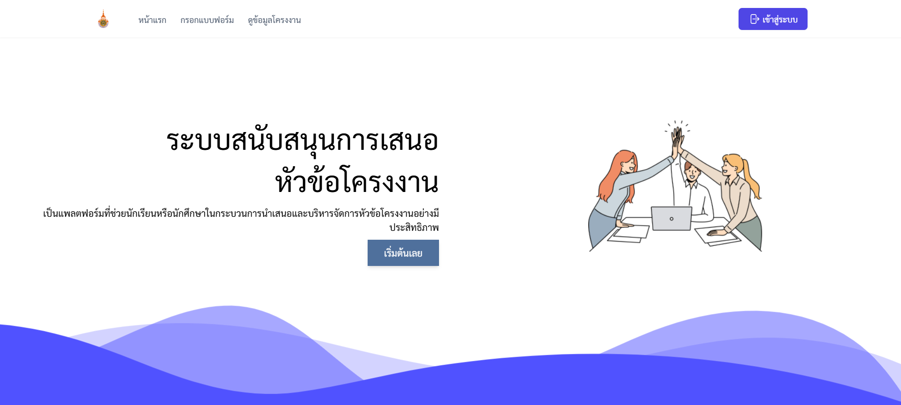
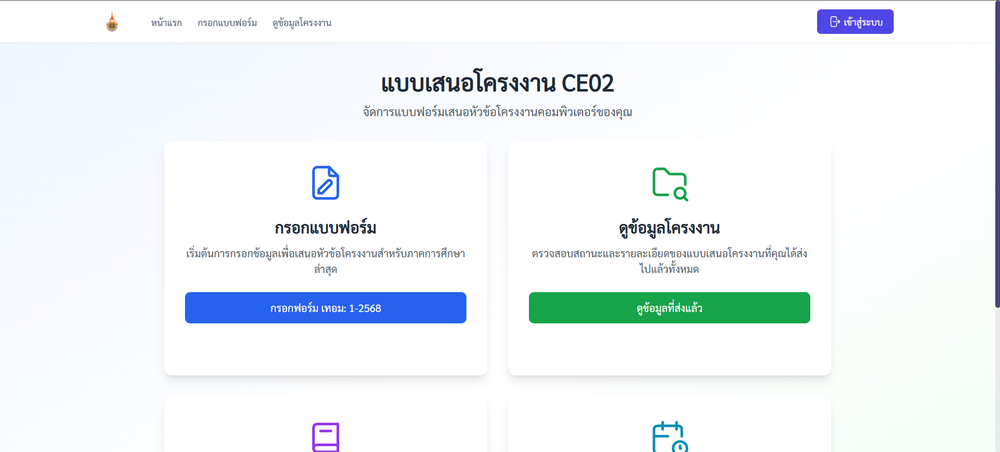
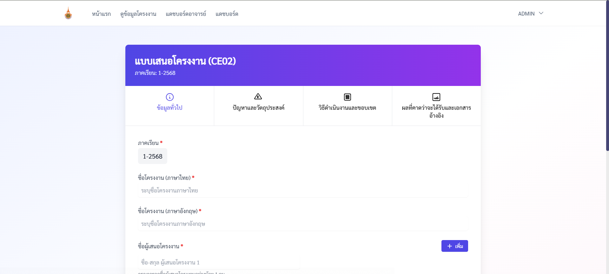
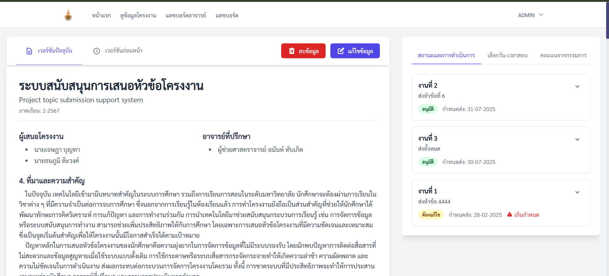
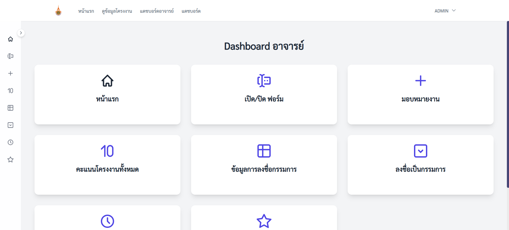
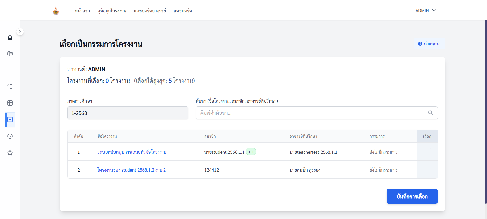

### rmutl-cpe-ce02: โครงงานจบการศึกษา มหาวิทยาลัยเทคโนโลยีราชมงคลล้านนา
โครงการนี้เป็นส่วนหนึ่งของโครงงานจบการศึกษาจากมหาวิทยาลัยเทคโนโลยีราชมงคลล้านนา (Rajamangala University of Technology Lanna - RMUTL) 

## เทคโนโลยีที่ใช้
* Svelte: เฟรมเวิร์ก JavaScript สำหรับการสร้างส่วนติดต่อผู้ใช้ที่มีประสิทธิภาพสูงและรวดเร็ว
* JavaScript: ภาษาหลักในการพัฒนาแอปพลิเคชัน
* Firebase: ฐานข้อมูลหลัก

## Software Requirement Specification (SRS)

ระบบประกอบด้วยโมดูลหลักดังต่อไปนี้:

* **SRS.1 โมดูลสมัครสมาชิกและการเข้าสู่ระบบ:** รองรับการสมัครสมาชิกและเข้าสู่ระบบด้วยอีเมล/รหัสผ่าน พร้อมรองรับผู้ใช้ 4 ประเภท (นักศึกษา, อาจารย์, อาจารย์ประจำวิชา, ผู้ดูแลระบบ)
* **SRS.2 โมดูลมอบหมายงาน:** อาจารย์ประจำวิชาสามารถเปิด/ปิดการกรอกฟอร์ม และกำหนดวันส่งงานได้
* **SRS.3 โมดูลกรอกแบบฟอร์มเสนอโครงงาน:** นักศึกษาสามารถกรอกฟอร์ม CE02 และแนบไฟล์รูปภาพประกอบ
* **SRS.4 โมดูลเรียกดูข้อมูลโครงงาน:** ผู้ใช้สามารถเรียกดูและค้นหาข้อมูลโครงงานตามเงื่อนไขต่างๆ
* **SRS.5 โมดูลจัดการข้อมูลโครงงาน:** รองรับการแก้ไขและลบข้อมูลโครงงาน
* **SRS.6 โมดูลการเลือกกรรมการ:** รองรับการเลือกหัวข้อโครงงานของอาจารย์ที่จะเป็นกรรมการ
* **SRS.7 โมดูลการนัดสอบ:** รองรับการส่งคำขอนัดสอบและแจ้งเตือนนัดหมาย
* **SRS.8 โมดูลการให้คะแนน:** กรรมการสามารถกรอกคะแนนและคำนวณคะแนนตามเกณฑ์ที่กำหนด
* **SRS.9 โมดูลจัดการข้อมูลส่วนตัว:** ผู้ใช้สามารถแก้ไขข้อมูลส่วนตัว เช่น ชื่อและรหัสผ่าน
* **SRS.10 โมดูลแดชบอร์ด:** ผู้ดูแลระบบสามารถดูข้อมูลภาพรวมและเปลี่ยนบทบาทของผู้ใช้งานได้

## Screenshots

### หน้าหลักของระบบ

### หน้าสำหรับนักศึกษา

### หน้าสำหรับอาจารย์

